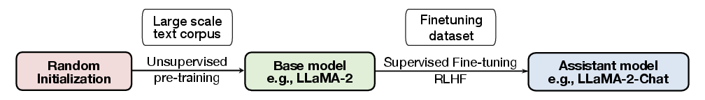
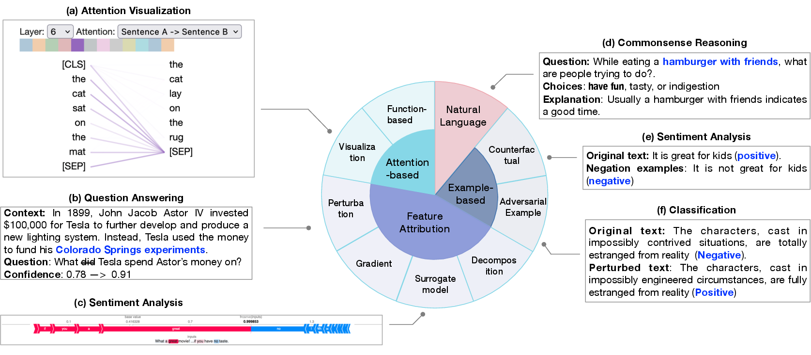

# Explainability-for-Large-Language-Models: A Survey

> 📖 Papers and resources related to our survey(["Explainability for Large Language Models: A Survey"](https://arxiv.org/abs/2309.01029)) are organized by the structure of the paper.

> 📧 Please feel free to reach out if you spot any mistake. We also highly value suggestions to improve our work, please don't hesitate to ping us at: hz54@njit.edu.

## Table of Contents
<!-- markdown-toc start - Don't edit this section. Run M-x markdown-toc-refresh-toc -->

- [Explainability-for-Large-Language-Models: A Survey](#explainability-for-large-language-models-a-survey)
  - [Table of Contents](#table-of-contents)
  - [Overview](#overview)
  - [Training Paradigms of LLMs](#training-paradigms-of-llms)
    - [Traditional Fine-Tuning Paradigm](#traditional-fine-tuning-paradigm)
    - [Prompting Paradigm](#prompting-paradigm)
  - [Explanation for Traditional Fine-Tuning Paradigm](#explanation-for-traditional-fine-tuning-paradigm)
    - [Local Explanation](#local-explanation)
      - [Feature Attribution-Based Explanation](#feature-attribution-based-explanation)
        - [Perturbation-Based Explanation](#perturbation-based-explanation)
        - [Gradient-Based Explanation](#gradient-based-explanation)
        - [Surrogate Models](#surrogate-models)
        - [Decomposition-Based Methods](#decomposition-based-methods)
      - [Attention-Based Explanation](#attention-based-explanation)
        - [Visualizations](#visualizations)
        - [Function-Based methods](#function-based-methods)
        - [Debate Over Attention](#debate-over-attention)
      - [Example-Based Explanations](#example-based-explanations)
        - [Adversarial Example](#adversarial-example)
        - [Counterfactual Explanation](#counterfactual-explanation)
        - [Data Influence](#data-influence)
      - [Natural Language Explanation](#natural-language-explanation)
    - [Global Explanation](#global-explanation)
      - [Probing-Based Explanation](#probing-based-explanation)
        - [Classifier-Based Probing](#classifier-based-probing)
        - [Parameter-Free Probing](#parameter-free-probing)
      - [Neuron Activation Explanation](#neuron-activation-explanation)
      - [Concept-Based Explanation](#concept-based-explanation)
      - [Mechanistic Interpretability](#mechanistic-interpretability)
    - [Making Use of Explanations](#making-use-of-explanations)
      - [Debugging Models](#debugging-models)
      - [Improving Models](#improving-models)
  - [Explanation for Prompting Paradigm](#explanation-for-prompting-paradigm)
    - [Base Model Explanation](#base-model-explanation)
      - [Explaining In-context Learning](#explaining-in-context-learning)
      - [Explaining CoT Prompting](#explaining-cot-prompting)
      - [Representation Engineering](#representation-engineering)
    - [Assistant Model Explanation](#assistant-model-explanation)
      - [Explaining the Role of Fine-tuning](#explaining-the-role-of-fine-tuning)
      - [Explaining Hallucination](#explaining-hallucination)
      - [Uncertainty Quantification](#uncertainty-quantification)
    - [Making Use of Explanations](#making-use-of-explanations-1)
      - [Improving LLMs](#improving-llms)
      - [Downstream Applications](#downstream-applications)
  - [Explanation Evaluation](#explanation-evaluation)
    - [Explanation Evaluations in Traditional Fine-tuning Paradigms](#explanation-evaluations-in-traditional-fine-tuning-paradigms)
      - [Evaluating plausibility](#evaluating-plausibility)
      - [Evaluating Faithfulness](#evaluating-faithfulness)
    - [Evaluation of Explanations in Prompting Paradigms](#evaluation-of-explanations-in-prompting-paradigms)
      - [Evaluating Plausibility](#evaluating-plausibility-1)
      - [Evaluating Faithfulness](#evaluating-faithfulness-1)

<!-- markdown-toc end -->


## Overview 
We categorize LLM explainability into two major paradigms. Based on this categorization, kinds of explainability techniques associated with LLMs belonging to these two paradigms are summarized as following:


## Training Paradigms of LLMs
### Traditional Fine-Tuning Paradigm
> A language model is first pre-trained on a large corpus of unlabeled text data, and then fine-tuned on a set of labeled data from a specific downstream domain.

1. Datasets

   [SST-2](https://huggingface.co/datasets/sst2), [MNLI](https://huggingface.co/datasets/multi_nli), [QQP](https://huggingface.co/Shobhank-iiitdwd/RoBERTa-large-QQP) , _etc_.

2. Models

   BERT, RoBERTa, ELECTRA, DeBERTa, _etc_.


### Prompting Paradigm
> The prompting paradigm involves using prompts, such as natural language sentences with blanks for the model to fill in, to enable zero-shot or few-shot learning without requiring additional training data. Models under this paradigm can be categorized into two types, based on their development stages: base model and assistant model. In this scenario, LLMs undergo unsupervised pre-training with random initialization to create a base model. The base model can then be fine-tuned through instruction tuning and RLHF to produce the assistant model.



1. Base Model

    GPT-3, OPT, LLaMA-1, LLaMA-2, Falcon, _etc_.

2. Assistant Model

    GPT-3.5, GPT 4, Claude, LLaMA-2-Chat, Alpaca, Vicuna, _etc_.

## Explanation for Traditional Fine-Tuning Paradigm
### Local Explanation
> Local Explanation focus on understanding how a language model makes a prediction for a specific input instance. 



#### Feature Attribution-Based Explanation
##### Perturbation-Based Explanation
1. **[Visualizing and Understanding Neural Models in NLP](https://aclanthology.org/N16-1082)**. _Jiwei Li et al_. ACL 2016.
2. **[Understanding Neural Networks through Representation Erasure](http://arxiv.org/abs/1612.08220)**. _Jiwei Li et al_. arXiv 2017.
3. **[Pathologies of Neural Models Make Interpretations Difficult](https://aclanthology.org/D18-1407)**. _Shi Feng et al_. EMNLP 2018.
4. **[Perturbed Masking: Parameter-free Probing for Analyzing and Interpreting BERT](https://aclanthology.org/2020.acl-main.383)**. _Zhiyong Wu et al_.  ACL 2020.
5. **[Resisting Out-of-Distribution Data Problem in Perturbation of XAI](http://arxiv.org/abs/2107.14000)**. _Luyu Qiu et al_. arXiv 2021. 
6. **[Towards a Deep and Unified Understanding of Deep Neural Models in NLP](http://proceedings.mlr.press/v97/guan19a.html)**. _Chaoyu Guan el al_. PMLR 2019.

##### Gradient-Based Explanation

1. **[The (Un)reliability of saliency methods](http://arxiv.org/abs/1711.00867)**. _Pieter-Jan Kindermans et al_. arXiv 2017.
2. **[Axiomatic attribution for deep networks](https://arxiv.org/abs/1703.01365)**. _Mukund Sundararajan et al_. ICML 2017.
3. **[Investigating Saturation Effects in Integrated Gradients](http://arxiv.org/abs/2010.12697)**. _Vivek Miglani et al_. ICML 2020.
4. **[Exploring the Role of BERT Token Representations to Explain Sentence Probing Results](http://arxiv.org/abs/2104.01477)**. _Hosein Mohebbi et al_. EMNLP 2021.
5. **[Integrated Directional Gradients: Feature Interaction Attribution for Neural NLP Models](https://aclanthology.org/2021.acl-long.71)**. _Sandipan Sikdar et al_. ACL 2021. 
6. **[Discretized Integrated Gradients for Explaining Language Models](http://arxiv.org/abs/2108.13654)**. _Soumya Sanyal et al_. EMNLP 2021.
7. **[A Rigorous Study of Integrated Gradients Method and Extensions to Internal Neuron Attributions](https://proceedings.mlr.press/v162/lundstrom22a.html)**. _Daniel D. Lundstrom et al_. ICML 2022.
8.  **[Sequential Integrated Gradients: a simple but effective method for explaining language models](http://arxiv.org/abs/2305.15853)**. _Joseph Enguehard_. ACL 2023.

##### Surrogate Models

1. **["Why Should I Trust You?": Explaining the Predictions of Any Classifier](http://arxiv.org/abs/1602.04938)**. _Marco Tulio Ribeiro et al_. arXiv 2016.
2. **[A Unified Approach to Interpreting Model Predictions](https://proceedings.neurips.cc/paper_files/paper/2017/hash/8a20a8621978632d76c43dfd28b67767-Abstract.html)**. _Scott M Lundberg et al_. NIPS 2017. 
3. **[BERT meets Shapley: Extending SHAP Explanations to Transformer-based Classifiers](https://aclanthology.org/2021.hackashop-1.3)**. _Enja Kokalj et al_. ACL 2021.
4. **[Algorithms to estimate Shapley value feature attributions](https://www.nature.com/articles/s42256-023-00657-x)**. _Hugh Chen et al_. Nature Machine Intelligence 2023.
5. **[A Causality Inspired Framework for Model Interpretation](https://dl.acm.org/doi/10.1145/3580305.3599240)**. _Chenwang Wu et al_. KDD 2023.

##### Decomposition-Based Methods

1. **[Explaining NonLinear Classification Decisions with Deep Taylor Decomposition](http://arxiv.org/abs/1512.02479)** _Grégoire Montavon et al_. arXiv 2015.
2. **[On Attribution of Recurrent Neural Network Predictions via Additive Decomposition](http://arxiv.org/abs/1903.11245)**. _Mengnan Du et al_. arXiv 2019.
3. **[Layer-wise relevance propagation: an overview](https://link.springer.com/chapter/10.1007/978-3-030-28954-6_10)**. _Grégoire Montavon et al_. 2019. 
4. **[Analyzing Multi-Head SelfAttention: Specialized Heads Do the Heavy Lifting, the Rest Can Be Pruned.](https://aclanthology.org/P19-1580)**. _Elena Voita et al_.  ACL 2019.
5. **[Analyzing the Source and Target Contributions to Predictions in Neural Machine Translation](https://aclanthology.org/2021.acl-long.91)**. _Elena Voita et al_. ACL 2021.
6. **[On Explaining Your Explanations of BERT: An Empirical Study with Sequence Classification](http://arxiv.org/abs/2101.00196)**. _Zhengxuan Wu et al_. arXiv 2021.
7. **[Transformer Interpretability Beyond Attention Visualization](https://ieeexplore.ieee.org/document/9577970/)**. _Hila Chefer et al_. CVPR 2021. 

#### Attention-Based Explanation
##### Visualizations
1. **[BertViz: A Tool for Visualizing Multi-Head Self-Attention in the BERT Model](https://arxiv.org/abs/1904.02679)**. _Jesse Vig_. arXiv 2019.
2. **[SANVis: Visual Analytics for Understanding SelfAttention Networks](http://arxiv.org/abs/1909.09595)**. _Cheonbok Park et al_. arXiv 2019.
3. **[exBERT: A Visual Analysis Tool to Explore Learned Representations in Transformer Models](https://aclanthology.org/2020.acl-demos.22)**. _Benjamin Hoover et al_. ACL 2020.
4. **[VisQA: X-raying Vision and Language Reasoning in Transformers](http://arxiv.org/abs/2104.00926)**. _Theo Jaunet et al_. arXiv 2021.
5. **[Attention Flows: Analyzing and Comparing Attention Mechanisms in Language Models](http://arxiv.org/abs/2009.07053)**. _Joseph F. DeRose et al_. arXiv 2020.
6. **[VisQA: X-raying Vision and Language Reasoning in Transformers](http://arxiv.org/abs/2104.00926)**. _Theo Jaunet et al_. CVPR 2021.
7. **[AttentionViz: A Global View of Transformer Attention](http://arxiv.org/abs/2305.03210)**. _Catherine Yeh et al_. arXiv 2023. 

##### Function-Based methods
1. **[Grad-SAM: Explaining Transformers via Gradient Self-Attention Maps](https://dl.acm.org/doi/10.1145/3459637.3482126)**. _Oren Barkan et al_. CIKM 2021.
2. **[Self-Attention Attribution: Interpreting Information Interactions Inside Transformer](https://ojs.aaai.org/index.php/AAAI/article/view/17533)**. _Yaru Hao et al_. AAAI 2021. 

##### Debate Over Attention
1. **[Is Attention Interpretable?](http://arxiv.org/abs/1906.03731)** _Sofia Serrano et al_. ACL 2019. 
2. **[Attention is not Explanation](http://arxiv.org/abs/1902.10186)**. _Sarthak Jain et al_. NAACL 2019.
3. **[Generating token-level explanations for natural language inference](https://arxiv.org/abs/1904.10717)**. _James Thorne et al_. NAACL 2019.
4. **[Are interpretations fairly evaluated? a definition driven pipeline for post-hoc interpretability](https://arxiv.org/abs/2009.07494)**. _Ninghao Liu et al_. arXiv 2020.
5. **[Attention Flows are Shapley Value Explanations](http://arxiv.org/abs/2105.14652)** _Kawin Ethayarajh et al_. ACL 2021.
6. **[Towards Transparent and Explainable Attention Models](https://aclanthology.org/2020.acl-main.387)**. _Akash Kumar Mohankumar et al_. ACL 2020. 
7. **[Why attentions may not be interpretable?](https://arxiv.org/abs/2006.05656)** _Bing Bai et al_. KDD 2021.
8. **[On identifiability in transformers](https://arxiv.org/abs/1908.04211)**. _Gino Brunner et al_.  ICLR 2020.
9. **[Order in the court: Explainable ai methods prone to disagreement](https://arxiv.org/abs/2105.03287)**. _Michael Neely et al_. ICML 2021.
10. **[Attention is not not Explanation](http://arxiv.org/abs/1908.04626)**. _Sarah Wiegreffe et al_. arXiv 2019. 
11. **[ What Does BERT Look at? An Analysis of BERT’s Attention](https://aclanthology.org/W19-4828)**. _Kevin Clark et al_. ACL 2019.
12. **[Measuring and improving faithfulness of attention in neural machine translation](https://aclanthology.org/2021.eacl-main.243/)**. _Pooya Moradi et al_. ACL 2021.
13. **[Marta: Leveraging human rationales for explainable text classification](https://ojs.aaai.org/index.php/AAAI/article/view/16734)**. _Ines Arous et al_. AAAI 2021.

#### Example-Based Explanations
##### Adversarial Example
1. **[Is bert really robust? natural language attack on text classification and entailment](https://arxiv.org/abs/1907.11932)** _Di Jin et al_. AAAI 2020.
2. **[BAE: BERT-based Adversarial Examples for Text Classification](http://arxiv.org/abs/2004.01970)**. _Siddhant Garg et al_. EMNLP 2020.
3. **[Contextualized Perturbation for Textual Adversarial Attack](https://aclanthology.org/2021.naacl-main.400)**. _Dianqi Li et al_. ACL 2021.
4. **[SemAttack: Natural Textual Attacks via Different Semantic Spaces](https://aclanthology.org/2022.findings-naacl.14)**. _Boxin Wang et al_. ACL 2022.

##### Counterfactual Explanation
1. **[Learning the Difference that Makes a Difference with Counterfactually-Augmented Data](https://arxiv.org/abs/1909.12434)**. _Divyansh Kaushik et al_. ICLR 2020.
2. **[Polyjuice: Generating Counterfactuals for Explaining, Evaluating, and Improving Models](https://aclanthology.org/2021.acl-long.523)**. _Tongshuang Wu et al_. ACL 2021. 
3. **[Explaining nlp models via minimal contrastive editing (mice)](https://arxiv.org/abs/2012.13985)**. _Alexis Ross et al_, ACL 2021.
4. **[Crest: A joint framework for rationalization and counterfactual text generation](https://arxiv.org/abs/2305.17075)**. _Marcos Treviso et al_.  ACL 2023.

##### Data Influence
1. **[Representer point selection for explaining deep neural networks]()**. *Chih-Kuan Yeh et al*. NIPS 2018.
2. **[Understanding black-box predictions via influence functions](https://proceedings.mlr.press/v70/koh17a.html)**. *Pang Wei Koh et al*. PMLR 2017.
3. **[Data shapley: Equitable valuation of data for machine learning](https://proceedings.mlr.press/v97/ghorbani19c.html)**. *Amirata Ghorbani et al*. PMLR 2019.
4. **[Data cleansing for models trained with sgd](https://papers.nips.cc/paper/8674-data-cleansing-for-models-trained-with-sgd)**. *Satoshi Hara et al*. NIPS 2019.
5. **[Estimating training data influence by tracing gradient descent](https://papers.nips.cc/paper/2020/file/e6385d39ec9394f2f3a354d9d2b88eec-Paper.pdf)**. *Garima Pruthi et al*. NIPS 2020.
6. **[Fastif: Scalable influence functions for efficient model interpretation and debugging](https://arxiv.org/abs/2012.15781)**. *Han Guo*. ACL 2020.
7. **[Studying large language model generalization with influence functions](https://arxiv.org/abs/2308.03296)**. *Roger Grosse et al*. arXiv 2023.


#### Natural Language Explanation
1. **[Explain Yourself! Leveraging Language Models for Commonsense Reasoning](https://aclanthology.org/P19-1487)**. _Nazneen Fatema Rajani et al_. ACL 2019. 
2. **[Local Interpretations for Explainable Natural Language Processing: A Survey](http://arxiv.org/abs/2103.11072)**. _Siwen Luo et al_.  arXiv 2022. 
3. **[Few-Shot Out-of-Domain Transfer Learning of Natural Language Explanations in a Label-Abundant Setup](https://aclanthology.org/2022.findings-emnlp.255)**. _Yordan Yordanov et al_. EMNLP 2022.

### Global Explanation
> Global Explanation aims to provide a broad understanding of how the LLM work in the level of model components, such as neurons, hidden layers and larger modules.

#### Probing-Based Explanation
##### Classifier-Based Probing
1. **[Evaluating Layers of Representation in Neural Machine Translation on Part-of-Speech and Semantic Tagging Tasks](https://aclanthology.org/I17-1001)**. _Yonatan Belinkov et al_. ACL 2017. 
2. **[Deep Biaffine Attention for Neural Dependency Parsing](http://arxiv.org/abs/1611.01734)**. _Timothy Dozat et al_. ICLR 2017. 
3. **[Dissecting Contextual Word Embeddings: Architecture and Representation](https://aclanthology.org/D18-1179)**. _Matthew E. Peters et al_.  ACL 2018.
4. **[Deep RNNs Encode Soft Hierarchical Syntax.](https://aclanthology.org/P18-2003)**. _Terra Blevins et al_.  ACL 2018. 
5. **[What Does BERT Learn about the Structure of Language?](https://aclanthology.org/P19-1356)**. _Ganesh Jawahar et al_. ACL 2019. 
6. **[What do you learn from context? Probing for sentence structure in contextualized word representations](https://arxiv.org/abs/1905.06316)**. _Ian Tenney et al_. ICLR 2019.
7. **[A Structural Probe for Finding Syntax in Word Representations](https://aclanthology.org/N19-1419)**. _John Hewitt et al_.  ACL 2019. 
8. **[Open sesame: getting inside bert’s linguistic knowledge](https://arxiv.org/abs/1906.01698)**. _Yongjie Lin et al_. ACL 2019.
9. **[BERT Rediscovers the Classical NLP Pipeline](https://aclanthology.org/P19-1452)**. _Ian Tenney et al_. ACL 2019.
10. **[How Does BERT Answer Questions?: A Layer-Wise Analysis of Transformer Representations](https://dl.acm.org/doi/10.1145/3357384.3358028)**. _Betty Van Aken et al_. ICKM 2019.
11. **[Revealing the Dark Secrets of BERT](http://arxiv.org/abs/1908.08593)**. _Olga Kovaleva et al_. EMNLP 2019.
12. **[What Does BERT Look at? An Analysis of BERT’s Attention.](https://aclanthology.org/W19-4828)**. _Kevin Clark et al_. ACL 2019.
13. **[Designing and Interpreting Probes with Control Tasks](https://aclanthology.org/D19-1275)**. _John Hewitt et al_. EMNLP 2019.
14. **[Classifier Probes May Just Learn from Linear Context Features](https://aclanthology.org/2020.coling-main.450)**. _Jenny Kunz et al_. ACL 2020.
15. **[Probing for Referential Information in Language Models](https://aclanthology.org/2020.acl-main.384)**. _Ionut-Teodor Sorodoc et al_. ACL 2020.
16. **[Structured Self-Attention Weights Encode Semantics in Sentiment Analysis](https://aclanthology.org/2020.blackboxnlp-1.24)**. _Zhengxuan Wu et al_. ACL 2020.
17. **[Probing BERT in Hyperbolic Spaces](http://arxiv.org/abs/2104.03869)**. _Boli Chen et al_. ICLR 2021.
18. **[Do Syntactic Probes Probe Syntax? Experiments with Jabberwocky Probing](http://arxiv.org/abs/2106.02559)**. _Rowan Hall Maudslay et al_. arXiv 2021.
19. **[Exploring the Role of BERT Token Representations to Explain Sentence Probing Results](http://arxiv.org/abs/2104.01477)**. _Hosein Mohebbi et al_. EMNLP 2021.
20. **[How is BERT surprised? Layerwise detection of linguistic anomalies](http://arxiv.org/abs/2105.07452)**. _Bai Li et al_. ACL 2021.
21. **[Probing Classifiers: Promises, Shortcomings, and Advances](https://direct.mit.edu/coli/article/48/1/207/107571/)** _Yonatan Belinkov_.  Computational Linguistics 2022. 
22. **[Probing GPT-3’s Linguistic Knowledge on Semantic Tasks](https://aclanthology.org/2022.blackboxnlp-1.24)**. _Lining Zhang et al_. ACL 2022.

##### Parameter-Free Probing
1. **[Targeted Syntactic Evaluation of Language Models](https://aclanthology.org/D18-1151)**. _Rebecca Marvin et al_. ACL 2018. 
2. **[Language Models as Knowledge Bases?](http://arxiv.org/abs/1909.01066)**. _Fabio Petroni et al_. EMNLP 2019.
3. **[On the Systematicity of Probing Contextualized Word Representations: The Case of Hypernymy in BERT](https://aclanthology.org/2020.starsem-1.10)**. _Abhilasha Ravichander_. ACL 2020.
4. **[ALL Dolphins Are Intelligent and SOME Are Friendly: Probing BERT for Nouns’ Semantic Properties and their Prototypicality](http://arxiv.org/abs/2110.06376)**. _Marianna Apidianaki et al_. BlackboxNLP 2021.
5. **[Factual Probing Is \[MASK\]: Learning vs. Learning to Recall](http://arxiv.org/abs/2104.05240)**. _Zexuan Zhong et al_. NAACL 2021.
6. **[Probing via Prompting](http://arxiv.org/abs/2207.01736)**. _Jiaoda Li et al_. NAACL 2022. 

#### Neuron Activation Explanation
1. **[Identifying and Controlling Important Neurons in Neural Machine Translation](http://arxiv.org/abs/1811.01157)**. _Anthony Bau et al_. arXiv 2018.
2. **[What Is One Grain of Sand in the Desert? Analyzing Individual Neurons in Deep NLP Models](https://ojs.aaai.org/index.php/AAAI/article/view/4592)**. _Fahim Dalvi et al_. AAAI 2019.
3. **[Intrinsic Probing through Dimension Selection](https://aclanthology.org/2020.emnlp-main.15)**. _Lucas Torroba Hennigen et al_. EMNLP 2020.
4. **[On the Pitfalls of Analyzing Individual Neurons in Language Models](http://arxiv.org/abs/2110.07483)**. _Omer Antverg et al_. ICML 2022.
5. **[Language models can explain neurons in language models](https://openai.com/research/language-models-can-explain-neurons-in-language-models?s=09)**. _OpenAI_. 2023.
6. **[Explaining black box text modules in natural language with language models](https://arxiv.org/abs/2305.09863)**. _Chandan Singh et al_. arXiv 2023.

#### Concept-Based Explanation
1. **[Interpretability Beyond Feature Attribution: Quantitative Testing with Concept Activation Vectors (TCAV)](http://arxiv.org/abs/1711.11279)**. _Been Kim et al_. ICML 2018.
2. **[Compositional Explanations of Neurons](http://arxiv.org/abs/2006.14032)**. _Jesse Mu et al_. NIPS 2020.

#### Mechanistic Interpretability
1. **[Decomposing language models into understandable components?](https://www.anthropic.com/index/decomposing-language-models-into-understandable-components)**. *Anthropic*. 2023.
2. **[Towards monosemanticity: Decomposing language models with dictionary learning](https://transformer-circuits.pub/2023/monosemantic-features/index.html)**. *Trenton Bricken et al*. 2023.
3. **[Zoom In: An Introduction to Circuits](https://distill.pub/2020/circuits/zoom-in/)**. *Chris Olah et al*. 2020.
4. **[Branch Specialization](https://distill.pub/2020/circuits/branch-specialization/)**. *Chelsea Voss et al*. 2021.
5. **[Weight Banding](https://distill.pub/2020/circuits/weight-banding/)**. Michael Petrov et al. 2021.
6. **[Naturally Occurring Equivariance in Neural Networks](https://distill.pub/2020/circuits/equivariance/)**. *Catherine Olsson et al*. 2020.
7. **[A Mathematical Framework for Transformer Circuits](https://transformer-circuits.pub/2021/framework/index.html)**. *Catherine Olsson et al*. 2021.
8. **[In-context Learning and Induction Heads](https://transformer-circuits.pub/2022/in-context-learning-and-induction-heads/index.html)**. *Catherine Olsson et al*. 2022.
9. **[Transformer feed-forward layers are key-value memories](https://arxiv.org/abs/2012.14913)**. *Mor Geva et al*. arXiv 2020.
10. **[Locating and editing factual associations in gpt](https://arxiv.org/abs/2202.05262)**. *Kevin Meng et al*. NIPS 2022.
11. **[Transformer feed-forward layers build predictions by promoting concepts in the vocabulary space](https://arxiv.org/abs/2203.14680)**. *Mor Geva et al*. arXiv 2022.
12. **[Residual networks behave like ensembles of relatively shallow networks](https://arxiv.org/abs/1605.06431)**. *Andreas Veit et al*. NIPS 2016.
13. **[The hydra effect: Emergent self-repair in language model computations](https://arxiv.org/abs/2307.15771)**. *Tom Lieberum et al*. arXiv 2023.
14. **[Does circuit analysis interpretability scale? evidence from multiple choice capabilities in chinchilla](https://arxiv.org/abs/2307.09458)**. *Tom Lieberum et al*. arXiv 2023.

### Making Use of Explanations
#### Debugging Models
1. **[Towards interpreting and mitigating shortcut learning behavior of nlu models](https://arxiv.org/abs/2103.06922)**. _Mengnan Du et al_. NAACL 2021.
2. **[Adversarial training for improving model robustness? look at both prediction and interpretation](https://arxiv.org/abs/2203.12709)**. _Hanjie Chen et al_. AAAI 2022.
3. **[Shortcut learning of large language models in natural language understanding](https://arxiv.org/abs/2208.11857)**. _Mengnan Du et al_. CACM 2023.

#### Improving Models
1. **[Er-test: Evaluating explanation regularization methods for language models](https://arxiv.org/abs/2205.12542)**. _Brihi Joshi et al_. EMNLP 2022.
2. **[Supervising model attention with human explanations for robust natural language inference](https://arxiv.org/abs/2104.08142)**. _Joe Stacey et al_. AAAI 2022.
3. **[Unirex: A unified learning framework for language model rationale extraction](https://arxiv.org/abs/2112.08802)**. _Aaron Chan et al_. ICML 2022.
4. **[Xmd: An end-to-end framework for interactive explanation-based debugging of nlp models](https://arxiv.org/abs/2210.16978)**. _Dong-Ho Lee et al_. arXiv 2022.
5. **[Post hoc explanations of language models can improve language models](https://arxiv.org/abs/2305.11426)**. _Jiaqi Ma et al_. arXiv 2023.


## Explanation for Prompting Paradigm
> In prompting paradigm, LLMs have shown impressive reasoning abilities including few-shot learning, chain-of-thought prompting ability and phenomena like hallucination, which lack in conventional fine-tuning paradigm. Given these emerging properties, the explainability research is expected to investigate the underlying mechanisms. The explanation towards prompting paradigm can be categorized into two folds following model development stages: base model explanation and assistant model explanation.

### Base Model Explanation
1. **[Chain-of-thought prompting elicits reasoning in large language models](https://arxiv.org/abs/2201.11903)**. *Jason Wei et al*. NIPS 2022.

#### Explaining In-context Learning
1. **[Towards understanding in-context learning with contrastive demonstrations and saliency maps](https://arxiv.org/abs/2307.05052)**. _Zongxia Li et al_. arXiv 2023.
2. **[Larger language models do in-context learning differently](https://arxiv.org/abs/2303.03846)**. _Jerry Wei et al_. arXiv 2023.

#### Explaining CoT Prompting
1. **[Analyzing chain-of-thought prompting in large language models via gradient-based feature attributions](https://arxiv.org/abs/2307.13339)**. _Skyler Wu et al_. ICML 2023.
2. **[Text and patterns: For effective chain of thought, it takes two to tango](https://arxiv.org/abs/2209.07686)**. _Aman Madaan et al_. arXiv 2022.
3. **[Towards understanding chain-of-thought prompting: An empirical study of what matters](https://arxiv.org/abs/2212.10001)**. _Boshi Wang et al_. ACL 2023.

#### Representation Engineering
1. **[Representation engineering: A top-down approach to ai transparency](https://arxiv.org/abs/2310.06824)**. *Andy Zou et al*. arXiv 2023.
2. **[The geometry of truth: Emergent linear structure in large language model representations of true/false datasets](https://arxiv.org/abs/2310.06824)**. *Samuel Marks et al*. arXiv 2023.
3. **[Language models represent space and time](https://arxiv.org/abs/2310.00492)**. *Wes Gurnee et al*. arXiv 2023.

### Assistant Model Explanation
#### Explaining the Role of Fine-tuning
1. **[Lima: Less is more for alignment](https://arxiv.org/abs/2305.11206)**. _Chunting Zhou et al_. arXiv 2023.
2. **[The false promise of imitating proprietary llms](https://arxiv.org/abs/2305.15717)**. _Arnav Gudibande et al_. arXiv 2023.
3. **[Llama-2: Open foundation and finetuned chat models](https://ai.meta.com/research/publications/llama-2-open-foundation-and-fine-tuned-chat-models/)**. _Hugo Touvron et al_. 2023. 
4. **[From language modeling to instruction following: Understanding the behavior shift in llms after instruction tuning](https://arxiv.org/abs/2310.00492)**. *Xuansheng Wu et al*. arXiv 2023.

#### Explaining Hallucination
1. **[Siren’s Song in the AI Ocean: A Survey on Hallucination in Large Language Models](http://arxiv.org/abs/2309.01219)**. *Yue Zhang et al*. arXiv 2023.
2. **[Look before you leap: An exploratory study of uncertainty measurement for large language models](https://arxiv.org/abs/2307.10236)**. *Yuheng Huang et al*. arXiv 2023.
3. **[On the Origin of Hallucinations in Conversational Models: Is it the Datasets or the Models?](Nouha Dziri)**. *Nouha Dziri et al*. ACL 2022.
4. **[Large Language Models Struggle to Learn Long-Tail Knowledge](http://arxiv.org/abs/2211.08411)**. *Nikhil Kandpal et al*. arXiv 2023.
5. **[Scaling Laws and Interpretability of Learning from Repeated Data](http://arxiv.org/abs/2205.10487)**. *Danny Hernandez et al*. arXiv 2022.
6. **[Sources of Hallucination by Large Language Models on Inference Tasks](http://arxiv.org/abs/2305.14552)**. *Nick McKenna et al*. arXiv 2023.
7. **[Do PLMs Know and Understand Ontological Knowledge?](https://aclanthology.org/2023.acl-long.173)**. *Weiqi Wu et al*. ACL 2023.
8. **[The Reversal Curse: LLMs trained on "A is B" fail to learn "B is A"](http://arxiv.org/abs/2309.12288)**. *Lukas Berglund et al*. arXiv 2023.
9. **[Investigating the Factual Knowledge Boundary of Large Language Models with Retrieval Augmentation](http://arxiv.org/abs/2307.11019)**. *Ruiyang Ren et al*. arXiv 2023.
10. **[Impact of Co-occurrence on Factual Knowledge of Large Language Models](http://arxiv.org/abs/2310.08256)**. *Cheongwoong Kang et al*. arXiv 2023.
11. **[Simple synthetic data reduces sycophancy in large language models](http://arxiv.org/abs/2308.03958)**. *Jerry Wei et al*. arXiv 2023. 
12. **[PaLM: Scaling Language Modeling with Pathways](http://arxiv.org/abs/2204.02311)**, *Aakanksha Chowdhery et al*. arXiv 2022.
13. **[When Do Pre-Training Biases Propagate to Downstream Tasks? A Case Study in Text Summarization](https://aclanthology.org/2023.eacl-main.234)**. *Faisal Ladhak et al*. ACL 2023.


#### Uncertainty Quantification
1. **[Look before you leap: An exploratory study of uncertainty measurement for large language models](https://arxiv.org/abs/2307.10236)**. _Yuheng Huang et al_. arXiv 2023.
2. **[Shifting attention to relevance: Towards the uncertainty estimation of large language models](https://arxiv.org/abs/2307.01379)**. _Jinhao Duan et al_. arXiv 2023.


### Making Use of Explanations
#### Improving LLMs
1. **[Orca: Progressive learning from complex explanation traces of gpt-4](https://arxiv.org/abs/2306.02707)**. _Subhabrata Mukherjee et al_. arXiv 2023.
2. **[Did you read the instructions? rethinking the effectiveness of task definitions in instruction learning](https://arxiv.org/abs/2306.01150)**. _Fan Yin et al_. ACL 2023.
3. **[Show your work: Scratchpads for intermediate computation with language models](https://arxiv.org/abs/2112.00114)**. *Maxwell Nye et al*. arXiv 2021.
4. **[The unreliability of explanations in few-shot prompting for textual reasoning](https://arxiv.org/abs/2205.03401)**. *Xi Ye et al*. NIPS 2022.
5. **[Explanation selection using unlabeled data for chain-of-thought prompting](https://arxiv.org/abs/2302.04813)**. *Xi Ye et al*. arXiv 2023.

#### Downstream Applications
1. **[Learning transferable visual models from natural language supervision](https://arxiv.org/abs/2103.00020)**. _Alec Radford et al_. CVPR 2021.
2. **[A Chatgpt aided explainable framework for zero-shot medical image diagnosis](https://arxiv.org/abs/2307.01981)**. _Jiaxiang Liu et al_. ICML 2023.

## Explanation Evaluation
> Explanation can be evaluated in multiple dimensions according to different metrics, such as plausibility, faithfulness, stability, etc. For each dimension, metrics can hardly align well with each other. Constructing standard metrics still remains an open challenge. In this part, we focus on two dimension: plausibility and faithfulness. And quantitative properties and metrics, which are usually more reliable than qualitative ones, are presented in detail. 

### Explanation Evaluations in Traditional Fine-tuning Paradigms
#### Evaluating plausibility
1. **[An Interpretability Evaluation Benchmark for Pre-trained Language Models](http://arxiv.org/abs/2207.13948)**. _Yaozong Shen et al_. arXiv 2022.  
2. **[Hatexplain: A benchmark dataset for explainable hate speech detection](https://arxiv.org/abs/2012.10289)**. _Binny Mathew et al_. AAAI 2021.
3. **[ERASER: A Benchmark to Evaluate Rationalized NLP Models](https://aclanthology.org/2020.acl-main.408)**. _Jay DeYoung et al_. ACL 2020.

#### Evaluating Faithfulness
1. **[Axiomatic attribution for deep networks](http://proceedings.mlr.press/v70/sundararajan17a/sundararajan17a.pdf)**. _Mukund Sundararajan et al_. ICML 2017.
2. **[The (Un)reliability of saliency methods](http://arxiv.org/abs/1711.00867)**. _Pieter-Jan Kindermans et al_. arXiv 2017.
3. **[Rethinking Attention-Model Explainability through Faithfulness Violation Test](https://proceedings.mlr.press/v162/liu22i/liu22i.pdf)**. _Yibing Liu et al_. ICML 2022.
4. **[Framework for Evaluating Faithfulness of Local Explanations](https://arxiv.org/abs/2202.00734)**. _Sanjoy Dasgupta et al_. arXiv 2022.
5. **[Improving the Faithfulness of Attention-based Explanations with Task-specific Information for Text Classification](https://aclanthology.org/2021.acl-long.40)**. _George Chrysostomou et al_. ACL 2021. 
6. **["Will You Find These Shortcuts?" A Protocol for Evaluating the Faithfulness of Input Salience Methods for Text Classification](http://arxiv.org/abs/2111.07367)**. _Jasmijn Bastings et al_. arXiv 2022.
7. **[A comparative study of faithfulness metrics for model interpretability methods](https://aclanthology.org/2022.acl-long.345/)**. _Chun Sik Chan et al_. ACL 2022.
8. **[Attention is not Explanation](http://arxiv.org/abs/1902.10186)**. _Sarthak Jain et al_. NAACL 2019.
9. **[Faithfulness Tests for Natural Language Explanations](http://arxiv.org/abs/2305.18029)**. _Pepa Atanasova et al_. ACL 2023.
10. **[Rev: information-theoretic evaluation of free-text rationales](https://arxiv.org/abs/2210.04982)**. _Hanjie Chen et al_. ACL 2023.


### Evaluation of Explanations in Prompting Paradigms
#### Evaluating Plausibility
1. **[Do models explain themselves? counterfactual simulatability of natural language explanations](https://arxiv.org/abs/2307.08678)**. _Yanda Chen et al_. arXiv 2023.

#### Evaluating Faithfulness
1. **[Language models don’t always say what they think: Unfaithful explanations in chain-of-thought prompting](https://arxiv.org/abs/2305.04388)**. _Miles Turpin et al_. arXiv 2023. 
2. **[Measuring faithfulness in chain-ofthought reasoning](https://arxiv.org/abs/2307.13702)**. *Tamera Lanham et al*. arXiv 2023.
3. **[Question decomposition improves the faithfulness of model-generated reasoning](https://arxiv.org/abs/2307.11768)**. *Ansh Radhakrishnan et al*. arXiv 2023.


-----
```
@article{zhao2023explainability,
  title={Explainability for Large Language Models: A Survey},
  author={Zhao, Haiyan and Chen, Hanjie and Yang, Fan and Liu, Ninghao and Deng, Huiqi and Cai, Hengyi and Wang, Shuaiqiang and Yin, Dawei and Du, Mengnan},
  journal={arXiv preprint arXiv:2309.01029},
  year={2023}
}
```
